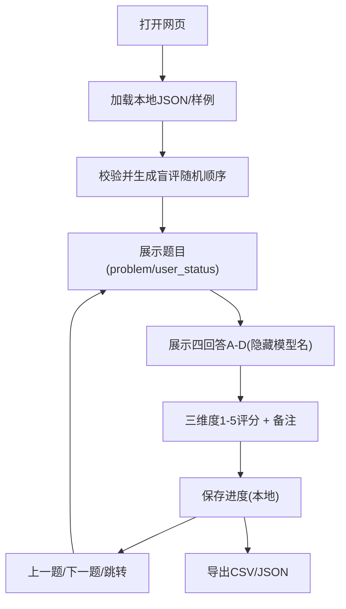

## 1. Product Overview
一个单页网页工具：加载本地 JSON 题目列表，按“盲评”方式随机展示四个模型回答，并对三项维度进行 1–5 评分，最后导出评分结果为 CSV/JSON。
面向需要快速做模型回答对比与主观打分的评测人员，减少人工整理与导出成本。

## 2. Core Features

### 2.1 User Roles
无需区分角色；默认单机使用（本地浏览器内完成加载、打分与导出）。

### 2.2 Feature Module
我们的需求由以下页面组成：
1. **评测工作台（单页）**：加载/切换数据集、题目与回答盲评展示、三维度评分与备注、进度与校验、导出结果。

### 2.3 Page Details
| Page Name | Module Name | Feature description |
|---|---|---|
| 评测工作台（单页） | 数据集加载 | 通过“选择本地文件”加载 JSON；提供内置样例数据按钮；解析并校验必填字段；加载失败给出错误原因。 |
| 评测工作台（单页） | 题目导航与进度 | 显示总题数、已完成数、完成率；支持上一题/下一题/跳转到指定题号；标记未评分题目。 |
| 评测工作台（单页） | 题目信息展示 | 展示当前题目的 problem 与 user_status（按原文显示，支持长文本折叠/展开）。 |
| 评测工作台（单页） | 盲评回答区（四模型） | 对四个模型回答进行随机顺序展示（隐藏模型名，仅显示“回答 A/B/C/D”）；每道题可一键“重新随机顺序”（可选）；允许显示/隐藏原始模型标识（用于复核）。 |
| 评测工作台（单页） | 三维度评分（1–5） | 对每个回答分别给出 3 个维度评分（1–5 整数）；支持键盘快捷键快速评分；未完成评分时阻止标记为完成。 |
| 评测工作台（单页） | 备注与判定 | 可为每个回答填写简短备注；可为整题填写总体备注（可选）。 |
| 评测工作台（单页） | 数据一致性与自动保存 | 在浏览器本地保存当前进度（刷新不丢失）；导入新数据集时提示是否覆盖当前进度；对导出内容进行字段完整性检查。 |
| 评测工作台（单页） | 导出 | 将所有题目评分与随机映射关系导出为 JSON；同时导出为 CSV（行级别：题目×回答）；导出文件名包含时间戳与数据集名（若有）。 |

## 3. Core Process
**评测员流程**：
1) 打开网页 → 选择本地 JSON（或加载样例）。
2) 进入第 1 题：阅读 problem 与 user_status。 
3) 在盲评回答区阅读 A/B/C/D 四个回答（顺序随机）。
4) 对每个回答按三维度分别打 1–5 分，并可写备注。
5) 点击“下一题”循环；页面显示进度与未完成提示。
6) 任意时刻导出：选择导出 JSON 或 CSV，保存到本地。

