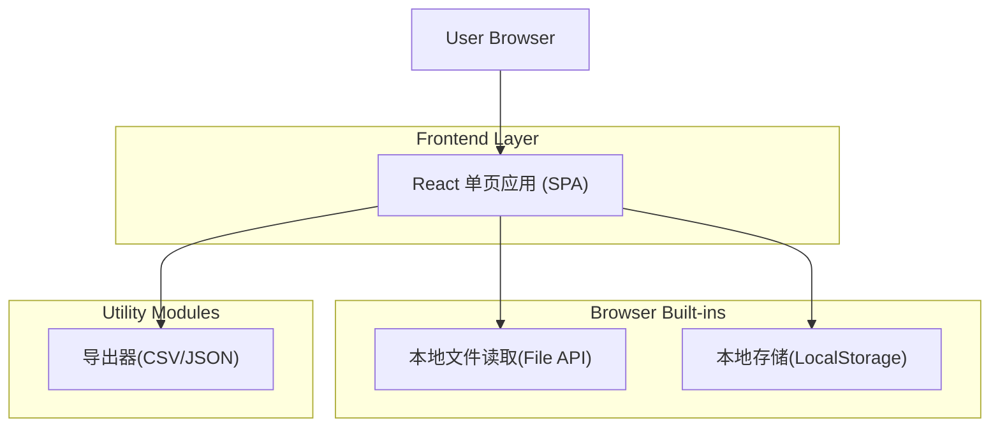

## 1.Architecture design

## 2.Technology Description
- Frontend: React@18 + TypeScript + vite
- UI: tailwindcss@3（或等价 CSS 方案）
- Data validation: zod（用于导入 JSON 的结构校验）
- Export: papaparse（JSON->CSV）
- Backend: None（纯前端本地运行）

## 3.Route definitions
| Route | Purpose |
|---|---|
| / | 评测工作台：加载数据、盲评展示、评分、导出 |

## 4.API definitions (If it includes backend services)
不包含后端服务，无需 API。

## 6.Data model(if applicable)

### 6.1 Data model definition
**导入 JSON（题目列表）建议结构**（最小可用字段）：
- dataset_name?: string
- items: Item[]

Item：
- id: string
- problem: string
- user_status: string
- answers: Record<string, string>  
  - 约定必须包含 4 个键（例如：model_1/model_2/model_3/model_4），值为回答文本

**评测结果（导出 JSON）建议结构**：
- dataset_name?: string
- exported_at: string(ISO)
- items: RatedItem[]

RatedItem：
- item_id: string
- blind_mapping: { A: string; B: string; C: string; D: string }  （A-D 对应的原始模型键）
- ratings: {
  A: { dim1: 1|2|3|4|5; dim2: 1|2|3|4|5; dim3: 1|2|3|4|5; note?: string }
  B: ...
  C: ...
  D: ...
}
- item_note?: string

### 6.2 Data Definition Language
无数据库，不需要 DDL。
